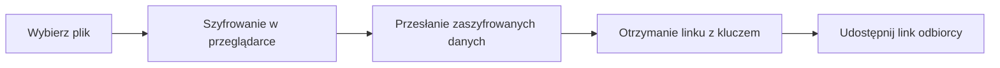

---
tags:
  - file-sharing
  - encryption
  - zero-knowledge
  - self-hosted
  - privacy
  - security
status: new
---

# White Ravens Archivum Null

White Ravens Archivum Null to usługa oparta na Naszym autorskim projekcie [Archivum Null](https://github.com/whiteravens20/archivum-null) – minimalistycznym narzędziu do bezpiecznego udostępniania plików z szyfrowaniem po stronie klienta. Pliki są szyfrowane **w Twojej przeglądarce** zanim trafią na serwer — dzięki temu nikt, nawet administrator, nie może odczytać ich zawartości.

!!! tip "Link"
    [White Ravens Archivum Null](https://archivum.wrservices.link/)

**Najważniejsze cechy:**

- :material-lock: **Zero-knowledge** — serwer przechowuje wyłącznie zaszyfrowane dane
- :material-account-off: **Bez kont** — nie trzeba się rejestrować ani logować
- :material-cookie-off: **Bez ciasteczek i śledzenia** — brak cookies, trackerów i reklam
- :material-timer-sand: **Wygasające sejfy** — pliki automatycznie znikają po określonym czasie lub liczbie pobrań

---

## Jak to działa?

Cały proces szyfrowania odbywa się **w Twojej przeglądarce** — serwer nigdy nie widzi oryginalnego pliku ani klucza szyfrowania.



!!! info "Gdzie jest klucz?"
    Klucz szyfrowania jest częścią linku, umieszczoną po znaku `#` (tzw. fragment URL). Przeglądarki {==nigdy nie wysyłają==} tej części adresu do serwera — klucz istnieje wyłącznie u nadawcy i odbiorcy.

---

## Jak udostępnić plik

### Krok 1: Wejdź na stronę

Otwórz [Archivum Null](https://archivum.wrservices.link/) w przeglądarce.

### Krok 2: Wybierz plik

Przeciągnij plik do okna przeglądarki lub kliknij, aby wybrać go z dysku.

!!! warning "Maksymalny rozmiar pliku"
    Maksymalny rozmiar pojedynczego pliku wynosi **100 MB**.

### Krok 3: Ustaw opcje sejfu

Przed przesłaniem możesz dostosować ustawienia:

| Opcja | Opis | Domyślnie |
|---|---|---|
| **Czas życia** | Jak długo sejf będzie dostępny | 24 godziny |
| **Limit pobrań** | Ile razy plik może zostać pobrany | 10 razy |

### Krok 4: Prześlij i skopiuj link

Po kliknięciu przycisku przesyłania:

1. Plik zostanie **zaszyfrowany w przeglądarce** algorytmem AES-256-GCM.
2. Zaszyfrowane dane trafią na serwer.
3. Otrzymasz **link do sejfu** — skopiuj go i wyślij odbiorcy.

!!! example "Przykładowy link"
    ```
    https://archivum.wrservices.link/vault/abc123#KLUCZ_SZYFROWANIA.NAZWA_PLIKU
    ```
    Część po `#` zawiera klucz i nazwę pliku — **nigdy nie jest wysyłana do serwera**.

---

## Jak pobrać udostępniony plik

1. Otwórz otrzymany link w przeglądarce.
2. Kliknij przycisk **pobierania**.
3. Plik zostanie **odszyfrowany w przeglądarce** i zapisany na dysku.

!!! note "Wygasłe sejfy"
    Jeśli sejf wygasł (minął czas życia lub wyczerpał się limit pobrań), plik nie będzie już dostępny — dane zostały trwale usunięte z serwera.

---

## Bezpieczeństwo i prywatność

### Co serwer wie

| Serwer **przechowuje** | Serwer **nie zna** |
|---|---|
| Zaszyfrowane dane (ciphertext) | Oryginalną treść pliku |
| Identyfikator sejfu (losowy) | Klucza szyfrowania |
| Rozmiar zaszyfrowanego pliku | Oryginalnej nazwy pliku |
| Datę utworzenia i wygaśnięcia | Tożsamości przesyłającego |
| Licznik pobrań | Adresu IP (tylko tymczasowo w pamięci) |

### Zastosowane zabezpieczenia

- **AES-256-GCM** — szyfrowanie uwierzytelnione zapewniające poufność i integralność danych
- **Unikalne klucze** — każdy plik szyfrowany jest osobnym, losowo wygenerowanym kluczem
- **Szyfrowanie po stronie klienta** — dane opuszczają przeglądarkę wyłącznie w formie zaszyfrowanej
- **Automatyczne usuwanie** — sejfy znikają po wygaśnięciu czasu życia lub limitu pobrań

---

## Dobre praktyki

!!! tip "Jak bezpiecznie udostępniać link"
    Link do sejfu zawiera klucz szyfrowania — traktuj go jak hasło! Wysyłaj link przez **szyfrowany komunikator** (np. Element, Signal), a nie przez niezaszyfrowany kanał.

!!! tip "Ustaw krótki czas życia"
    Jeśli plik ma być pobrany jednorazowo, ustaw **limit pobrań na 1** i **krótki czas życia**. Dzięki temu po pobraniu sejf automatycznie się usunie.

---

## Najczęściej zadawane pytania

??? question "Czy muszę się rejestrować?"
    Nie. Archivum Null nie wymaga konta, logowania ani żadnych danych osobowych.

??? question "Czy administrator może odczytać moje pliki?"
    Nie. Serwer przechowuje wyłącznie zaszyfrowane dane. Klucz szyfrowania nigdy nie trafia na serwer — istnieje tylko w linku, który udostępniasz odbiorcy.

??? question "Co się stanie, gdy sejf wygaśnie?"
    Zaszyfrowane dane zostaną trwale usunięte z serwera. Nie ma możliwości ich odzyskania.

??? question "Czy mogę przesłać wiele plików naraz?"
    Każdy plik tworzy osobny sejf z własnym linkiem. Przesyłaj pliki pojedynczo.

??? question "Dlaczego przeglądarka pokazuje ostrzeżenie o certyfikacie?"
    Jeśli korzystasz z instancji deweloperskiej (`localhost`), przeglądarka wyświetli ostrzeżenie o samopodpisanym certyfikacie. Instancja produkcyjna na [archivum.wrservices.link](https://archivum.wrservices.link/) posiada prawidłowy certyfikat TLS.

---

White Ravens Archivum Null to proste, anonimowe i bezpieczne narzędzie do jednorazowego udostępniania plików — bez kont, bez śledzenia, z pełnym szyfrowaniem po stronie klienta.
