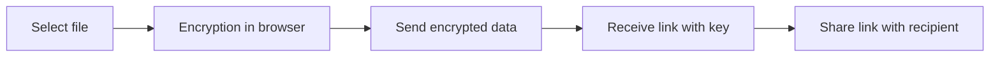

---
tags:
  - file-sharing
  - encryption
  - zero-knowledge
  - self-hosted
  - privacy
  - security
---

# White Ravens Archivum Null

White Ravens Archivum Null is a service based on our proprietary project [Archivum Null](https://github.com/whiteravens20/archivum-null) — a simple tool for securely sharing files. Files are encrypted **in your browser** before reaching the server — meaning no one, not even the administrator, can read their contents.

!!! tip "Link"
    [White Ravens Archivum Null](https://archivum.wrservices.link/)

**Key features:**

- :material-lock: **Zero-knowledge** — the server stores only encrypted data
- :material-account-off: **No accounts** — no registration or login required
- :material-cookie-off: **No cookies or tracking** — no cookies, trackers, or ads
- :material-timer-sand: **Expiring vaults** — files automatically disappear after a set time or number of downloads

---

## How does it work?

The entire encryption process happens **in your browser** — the server never sees the original file or the encryption key.



!!! info "Where is the key?"
    The encryption key is part of the link (after the `#` sign). Browsers {==never send==} this part of the address to the server — the key exists only with the sender and recipient.

---

## How to share a file

### Step 1: Go to the website

Open [Archivum Null](https://archivum.wrservices.link/) in your browser.

### Step 2: Select a file

Drag a file into the browser window or click to select it from your disk.

!!! warning "Maximum file size"
    The maximum size of a single file is **1 GB**.

### Step 3: Set vault options

Before uploading, you can adjust the settings:

| Option | Description | Default |
|---|---|---|
| **Lifetime** | How long the vault will be available | 24 hours |
| **Download limit** | How many times the file can be downloaded | 10 times |

### Step 4: Upload and copy the link

After clicking the upload button:

1. The file will be **encrypted in your browser** with strong encryption.
2. The encrypted data will be sent to the server.
3. You'll receive a **vault link** — copy it and send it to the recipient.

!!! example "Example link"
    ```
    https://archivum.wrservices.link/vault/abc123#ENCRYPTION_KEY.FILE_NAME
    ```
    The part after `#` contains the key and file name — **it is never sent to the server**.

---

## How to download a shared file

1. Open the received link in your browser.
2. Click the **download** button.
3. The file will be **decrypted in your browser** and saved to your disk.

!!! note "Expired vaults"
    If the vault has expired (lifetime has passed or download limit has been reached), the file will no longer be available — the data has been permanently deleted from the server.

---

## Security and privacy

### What the server knows

| Server **stores** | Server **doesn't know** |
|---|---|
| Encrypted data (unreadable) | Original file content |
| Random vault identifier | Encryption key |
| Size of encrypted file | Original file name |
| Creation and expiration date | Who the sender is |
| Download counter | — |

### Applied security measures

- :material-shield-lock: **Strong encryption** — data is protected with top-tier encryption (banking standard)
- :material-key-variant: **Unique keys** — each file has its own randomly generated key
- :material-laptop: **Browser-side encryption** — data leaves the browser only in encrypted form
- :material-delete-clock: **Automatic deletion** — vaults disappear after lifetime or download limit expiration

---

## Best practices

!!! tip "How to securely share the link"
    The vault link contains the encryption key — treat it like a password! Send the link through an **encrypted messenger** (e.g., Element, Signal), not through an unencrypted channel.

!!! tip "Set a short lifetime"
    If the file is meant to be downloaded once, set the **download limit to 1** and a **short lifetime**. This way, after downloading, the vault will automatically be deleted.

---

## Frequently asked questions

??? question "Do I need to register?"
    No. Archivum Null doesn't require an account, login, or any personal data.

??? question "Can the administrator read my files?"
    No. The server stores only encrypted data. The encryption key never reaches the server — it exists only in the link you share with the recipient.

??? question "What happens when a vault expires?"
    The encrypted data will be permanently deleted from the server. There is no way to recover it.

??? question "Can I upload multiple files at once?"
    Each file creates a separate vault with its own link. Upload files one at a time.

---

White Ravens Archivum Null is a simple, anonymous, and secure tool for one-time file sharing — without accounts, without tracking, with full client-side encryption.
