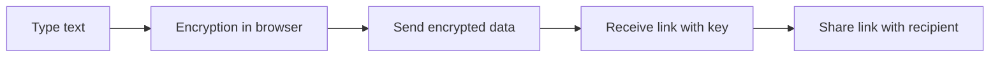

---
tags:
  - pastebin
  - encryption
  - zero-knowledge
  - self-hosted
  - privacy
status: new
---

# White Ravens PrivateBin

White Ravens PrivateBin is a service based on the [PrivateBin](https://privatebin.info/) project — a simple, open-source tool for securely sharing text. Content is encrypted and decrypted **exclusively in your browser** — the server never sees the original content.

!!! tip "Link"
    [White Ravens PrivateBin](https://privatebin.wrservices.link/)

**Key features:**

- :material-lock: **Zero-knowledge** — the server stores only encrypted data
- :material-account-off: **No registration** — no account needed
- :material-timer-sand: **Expiring pastes** — content can automatically disappear after a set time
- :material-fire: **Burn after reading** — paste can be deleted immediately after the first read
- :material-comment-text: **Discussions** — ability to add encrypted comments to pastes
- :material-language-markdown: **Markdown** — text formatting support with live preview

---

## How does it work?

PrivateBin encrypts content directly in your browser before data reaches the server. The encryption key is part of the link (after the `#` sign), which browsers {==never send==} to the server.



---

## Creating a new paste

### Step 1: Go to the website

Open [White Ravens PrivateBin](https://privatebin.wrservices.link/) in your browser.

### Step 2: Enter content

Paste or type text in the main editing field. This can be:

- notes or instructions,
- code snippets or logs,
- any text you want to share.

### Step 3: Set options

Before sending, adjust the paste settings:

| Option | Description |
|---|---|
| **Expiration time** | How long before the paste is deleted (5 min, 1 hour, 1 day, 1 week, 1 month, 1 year, or never) |
| **Burn after reading** | The paste will be automatically deleted after the first opening |
| **Discussion** | Allows others to add encrypted comments |
| **Password** | Additional protection — the recipient must know the password to decrypt the content |
| **Format** | Plain text, Markdown, or source code with syntax highlighting |

### Step 4: Send and copy the link

1. Click the **Send** button.
2. Copy the generated link.
3. Send the link to the recipient.

!!! example "Example link"
    ```
    https://privatebin.wrservices.link/?abc123#ENCRYPTION_KEY
    ```
    The part after `#` is the key — **it never reaches the server**.

---

## Reading a paste

1. Open the received link in your browser.
2. If the paste is password-protected — enter the password in the form.
3. The content will be **decrypted in your browser** and displayed.

!!! note "Burn after reading"
    If the paste was marked as "burn after reading," after a one-time opening it will be **permanently deleted** from the server. There will be no way to access it again.

---

## Additional features

### Discussions

After enabling the **Discussion** option, recipients can add comments to the paste. Each comment is encrypted the same way as the original content — the server doesn't see their contents.

### Code highlighting

By choosing the **Source code** format, PrivateBin automatically highlights code syntax, making it easier to read. Useful when sharing code snippets with others.

### Markdown

The **Markdown** format allows creating formatted documents with headings, lists, links, and other elements — with live preview during editing.

---

## Security and privacy

| Server **stores** | Server **doesn't know** |
|---|---|
| Encrypted data (unreadable) | Original paste content |
| Creation and expiration date | Encryption key |
| Paste settings | Password (if set) |

!!! warning "Important"
    The encryption key is an integral part of the link. Anyone who has the link can read the paste (unless it's password-protected). Share the link only through **encrypted communication channels**.

---

## Frequently asked questions

??? question "Do I need to register?"
    No. PrivateBin doesn't require an account or login.

??? question "Can the administrator read my pastes?"
    No. The server stores only encrypted data. The encryption key exists only in the link.

??? question "What happens when a paste expires?"
    The encrypted data will be permanently deleted from the server. There is no way to recover it.

??? question "How to additionally secure a paste?"
    Set a **password** when creating the paste. Even if someone accidentally obtains the link, they won't be able to read the content without knowing the password.

??? question "How is PrivateBin different from regular Pastebin?"
    Regular Pastebin stores content in plain text — the server administrator and anyone who gains access to the database can read it. PrivateBin encrypts data in the browser, so the server never sees the original content.

---

White Ravens PrivateBin is a simple, secure tool for one-time sharing of text and code — without accounts, without tracking, with full client-side encryption.
