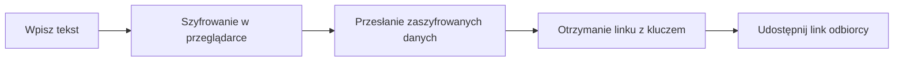

---
tags:
  - pastebin
  - encryption
  - zero-knowledge
  - self-hosted
  - privacy
status: new
---

# White Ravens PrivateBin

White Ravens PrivateBin to usługa oparta na projekcie [PrivateBin](https://privatebin.info/) – prostym, otwartoźródłowym narzędziu do bezpiecznego udostępniania tekstu. Treść jest szyfrowana i odszyfrowywana **wyłącznie w Twojej przeglądarce** — serwer nigdy nie widzi oryginalnej treści.

!!! tip "Link"
    [White Ravens PrivateBin](https://privatebin.wrservices.link/)

**Najważniejsze cechy:**

- :material-lock: **Zero-knowledge** — serwer przechowuje wyłącznie zaszyfrowane dane
- :material-account-off: **Bez rejestracji** — nie trzeba zakładać konta
- :material-timer-sand: **Wygasanie wklejek** — treść może automatycznie zniknąć po określonym czasie
- :material-fire: **Spalanie po przeczytaniu** — wklejka może zostać usunięta natychmiast po pierwszym odczycie
- :material-comment-text: **Dyskusje** — możliwość dodawania zaszyfrowanych komentarzy do wklejek
- :material-language-markdown: **Markdown** — obsługa formatowania tekstu z podglądem na żywo

---

## Jak to działa?

PrivateBin szyfruje treść bezpośrednio w przeglądarce, zanim dane trafią na serwer. Klucz szyfrowania jest częścią linku (po znaku `#`), który przeglądarki {==nigdy nie wysyłają==} do serwera.



---

## Tworzenie nowej wklejki

### Krok 1: Wejdź na stronę

Otwórz [White Ravens PrivateBin](https://privatebin.wrservices.link/) w przeglądarce.

### Krok 2: Wpisz treść

Wklej lub wpisz tekst w głównym polu edycji. Może to być:

- notatki lub instrukcje,
- fragmenty kodu lub logi,
- dowolny tekst, którym chcesz się podzielić.

### Krok 3: Ustaw opcje

Przed wysłaniem dostosuj ustawienia wklejki:

| Opcja | Opis |
|---|---|
| **Czas wygaśnięcia** | Po jakim czasie wklejka zostanie usunięta (5 min, 1 godz., 1 dzień, 1 tydzień, 1 miesiąc, 1 rok lub nigdy) |
| **Spalanie po przeczytaniu** | Wklejka zostanie automatycznie usunięta po pierwszym otwarciu |
| **Dyskusja** | Pozwala innym dodawać zaszyfrowane komentarze |
| **Hasło** | Dodatkowa ochrona — odbiorca musi znać hasło, aby odszyfrować treść |
| **Format** | Zwykły tekst, Markdown lub kod źródłowy z podświetlaniem składni |

### Krok 4: Wyślij i skopiuj link

1. Kliknij przycisk **Wyślij**.
2. Skopiuj wygenerowany link.
3. Wyślij link odbiorcy.

!!! example "Przykładowy link"
    ```
    https://privatebin.wrservices.link/?abc123#KLUCZ_SZYFROWANIA
    ```
    Część po `#` to klucz — **nigdy nie trafia na serwer**.

---

## Odczytywanie wklejki

1. Otwórz otrzymany link w przeglądarce.
2. Jeśli wklejka jest chroniona hasłem — wpisz je w formularzu.
3. Treść zostanie **odszyfrowana w przeglądarce** i wyświetlona.

!!! note "Spalanie po przeczytaniu"
    Jeśli wklejka została oznaczona jako „spalanie po przeczytaniu", po jednorazowym otwarciu zostanie **trwale usunięta** z serwera. Nie będzie możliwości ponownego dostępu.

---

## Funkcje dodatkowe

### Dyskusje

Po włączeniu opcji **Dyskusja** odbiorcy mogą dodawać komentarze do wklejki. Każdy komentarz jest szyfrowany w taki sam sposób jak oryginalna treść — serwer nie widzi ich zawartości.

### Kolorowanie kodu

Wybierając format **Kod źródłowy**, PrivateBin automatycznie koloruje składnię kodu, co ułatwia jego czytanie. Przydatne, gdy udostępniasz fragmenty kodu innym osobom.

### Markdown

Format **Markdown** pozwala tworzyć sformatowane dokumenty z nagłówkami, listami, linkami i innymi elementami — z podglądem na żywo podczas edycji.

---

## Bezpieczeństwo i prywatność

| Serwer **przechowuje** | Serwer **nie zna** |
|---|---|
| Zaszyfrowane dane (nieczytelne) | Oryginalnej treści wklejki |
| Datę utworzenia i wygaśnięcia | Klucza szyfrowania |
| Ustawienia wklejki | Hasła (jeśli ustawione) |

!!! warning "Ważne"
    Klucz szyfrowania jest integralną częścią linku. Każdy, kto posiada link, może odczytać wklejkę (chyba że jest chroniona hasłem). Udostępniaj link wyłącznie przez **szyfrowane kanały komunikacji**.

---

## Najczęściej zadawane pytania

??? question "Czy muszę się rejestrować?"
    Nie. PrivateBin nie wymaga konta ani logowania.

??? question "Czy administrator może odczytać moje wklejki?"
    Nie. Serwer przechowuje wyłącznie zaszyfrowane dane. Klucz szyfrowania istnieje tylko w linku.

??? question "Co się stanie, gdy wklejka wygaśnie?"
    Zaszyfrowane dane zostaną trwale usunięte z serwera. Nie ma możliwości ich odzyskania.

??? question "Jak dodatkowo zabezpieczyć wklejkę?"
    Ustaw **hasło** przy tworzeniu wklejki. Nawet jeśli ktoś przypadkowo uzyska link, nie będzie mógł odczytać treści bez znajomości hasła.

??? question "Czym PrivateBin różni się od zwykłego Pastebin?"
    Zwykły Pastebin przechowuje treść w postaci jawnej — administrator serwera i każdy, kto uzyska dostęp do bazy danych, może ją odczytać. PrivateBin szyfruje dane w przeglądarce, więc serwer nigdy nie widzi oryginalnej treści.

---

White Ravens PrivateBin to proste, bezpieczne narzędzie do jednorazowego udostępniania tekstu i kodu — bez kont, bez śledzenia, z pełnym szyfrowaniem po stronie klienta.
